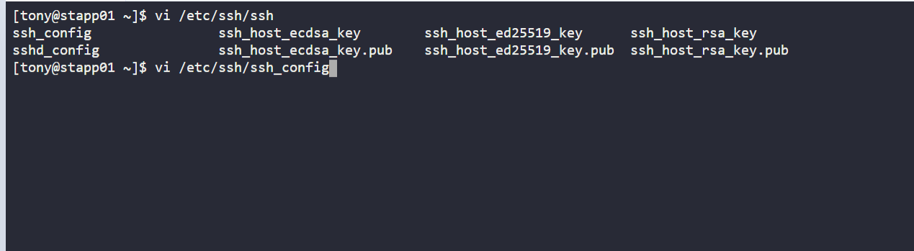

1. SSH into server
    
        ssh tony@stapp01
        sudo su -

2. Configure the root user
 
      

3. Change the permitrootlogin to no
   
      

4. Restart sshd service 

        systemctl restart sshd

5. Repeat for app server 2 and 3