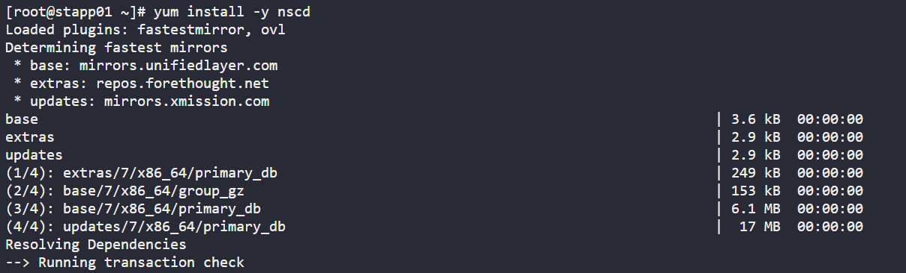
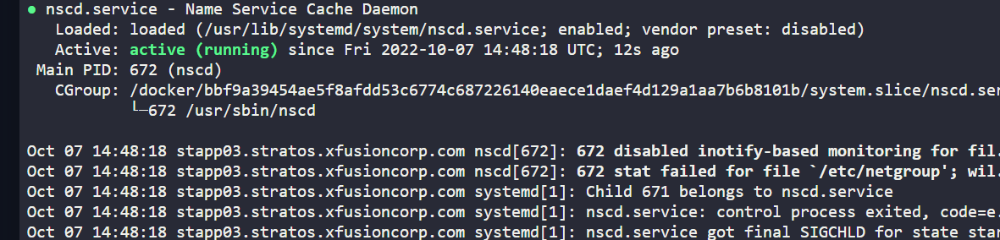

1. SSH into webserver 

        ssh tony@stapp01
        sudo su -

2. Install nscd into appserver

3. Start Service and enable it to start on boot server

        systemctl start nscd
        systemctl enable nscd
        systemctl status nscd

4. Repeat procedure on appserver 2 and 3